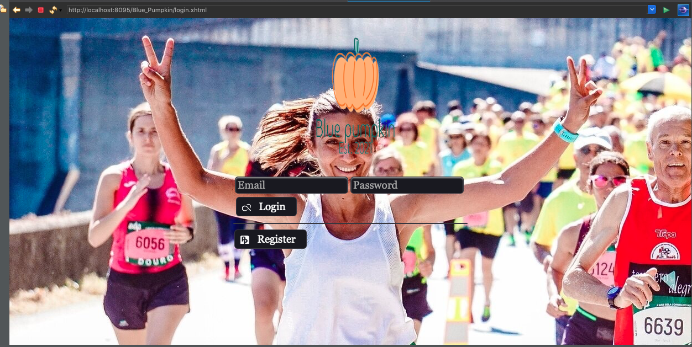

# BluePumpkin
For our Software Design and Analysis project, we are designing a cross platform (accessed through the internet and mobile applications) Event Management System for a fictional Event Management firm named “Blue pumpkin”. It will provide the clients of the firm with an easy-to-use platform for communicating with the organizers, whilst also reducing the firm’s labor load. Our purpose is to override the problems prevailing in the practicing manual system and provide OUR clients (Blue pumpkin) with a system which will link them to their account, store and categorize their Events (according to dates/ most time required for planning/level of urgency etc.) so they can function efficiently and provide their best service.  
Our management system has 2 basic categories: 
•	For Admin of the Firm 
•	For Employees of the Firm 
For the Admin, this management system will provide them access to digitalize all their personnel records and manager would be given access to add/edit/remove an employee along with viewing the orders and more. Similarly, for customers, this management system will be providing them with ease of access. For a customer, this system will be divided into the following three sections:  
1.	Event Venue bookings and Scheduling 
2.	Clubs
3.	Activity
No formal knowledge is needed for the user to use this system as we tried to keep it as minimal as possible, making it a user-friendly software.  
The clients will be able to select either pre-defined packages or customize a package according to his/her need. Clients will create an account to use the application, select the option for obtaining event management services and then fill in the respective sections with what they desire. All the information will be stored in a database, from which the firm will access it according to their needs.  
Our Management System is not only digitalizing the booking of orders providing ease of access to the customers, but will also digitalize the firm’s functionalities such as adding/removing employees. In short, our management system will digitalize the whole firm along with its jobs.  

## Demo
> User currently login both member role and manager role.

1. ___Login page___
    

 
    
